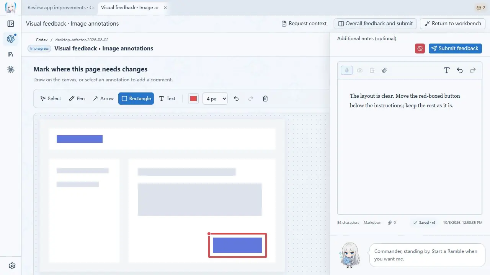
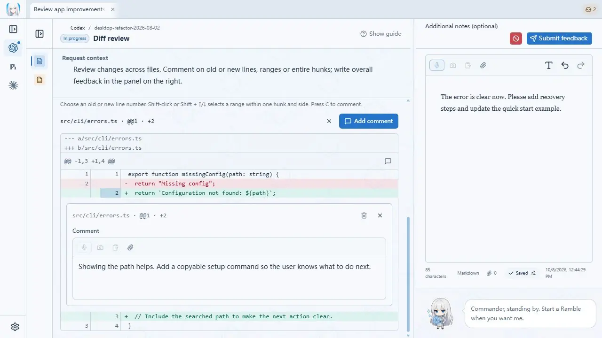
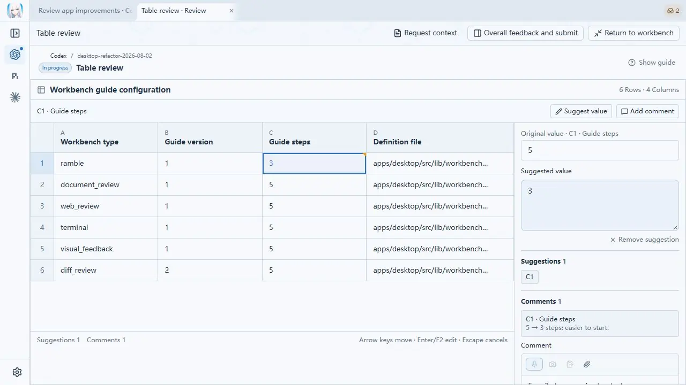

<p align="center">
  <picture>
    <source media="(prefers-color-scheme: dark)" srcset="docs/social/readme-header-dark.webp" />
    <source media="(prefers-color-scheme: light)" srcset="docs/social/readme-header-light.webp" />
    
  </picture>
</p>

<p align="center"><strong>A new interface for working with agents</strong></p>

<p align="center">
  <a href="README.md">English</a> · <a href="README.zh-CN.md">简体中文</a>
</p>

**RambleDesk wants to move collaboration beyond the chat box.**

RambleDesk is a desktop workbench for working with coding agents. When you need to try their work, point out a problem, or decide what happens next, it gives you a place to do that.

The agent explains its progress, presents its work, and tells you what to try or decide. You can mark a problem in an image, comment on a code change, or simply say what you think. RambleDesk gathers your feedback and supporting material so the agent can continue the task.

[Download](https://github.com/l1veIn/rambledesk/releases/latest) · [Get started](#get-started) · [Documentation](docs/README.md)

## How does feedback move a task forward?

Say you ask an agent to adjust a page. After making its changes, it asks you to try the result and confirm how it feels.

1. **See the result and what needs your attention.** The workbench explains what changed and what you should try or decide.
2. **Leave feedback where it belongs.** Mark a misplaced button, comment on the relevant code change, or say, “The layout looks good. Move the button up a little.”
3. **Send it back and keep going.** Your comments and attachments go back to the agent. In sessions started inside RambleDesk, submitting feedback queues the next turn in the original conversation, with delivery status visible in the workbench.

The workbench records your feedback and suggestions; it does not directly edit your project's files.

## Give feedback on the work itself

These screenshots illustrate the **0.5.0 workbenches** with demo data.

### Images: point out what needs changing

Mark an area and explain the adjustment so the agent knows exactly where you mean.



### Code: put comments beside the change

Comment on a specific changed line, keeping the location and context with your feedback.



### Tables: suggest a specific correction

Enter a proposed value for a cell and explain why it should change.



You can also add text, voice, and attachments. Optional AI cleanup helps organize your wording while preserving your original feedback. Unfinished feedback is saved as a draft.

## Get started

Download **0.5.0** for **Windows x64** or **macOS Apple Silicon** from [GitHub Releases](https://github.com/l1veIn/rambledesk/releases).

### Start a task inside RambleDesk

1. **Connect an agent.** Open **Settings → Agents**. Follow the prompts to install supported components or connect an existing agent such as Claude Code, Codex CLI, or Gemini CLI. Sign-in and model access belong to the agent itself.
2. **Give it a task.** Start a session, choose an agent and project folder, and describe your goal.
3. **Try it and respond.** When a feedback request arrives, review the result, follow its steps, and submit your comments. Feedback returns to the original conversation so the task can continue.

### Connect your existing agent app or CLI

Open **Settings → External adapters** and follow the [integration guide](docs/COMPATIBILITY.md). How the task continues after delivery depends on the adapter; Generic MCP requires returning to the agent manually.

### Voice and AI cleanup

Text feedback needs no extra setup. For speech, download a local transcription model in **Settings → Voice** and allow microphone access. AI cleanup is optional and needs a separately configured model service.

### Installation and upgrades

The Windows installer is not Authenticode-signed; macOS builds are not notarized. See the [installation guide](docs/INSTALLATION.md).

Before upgrading from 0.4.0, make a complete backup: **0.4.0 cannot open the upgraded database**. See [upgrade and rollback guidance](docs/DATA_COMPATIBILITY.md).

## Why this design?

From ChatGPT to today's coding agents, interfaces have moved into IDEs, terminals, and browsers. We still tend to put our requests, questions, and feedback into a chat box.

As agents take on more work independently, the moments that need human involvement change: trying the result, adding context the agent lacks, or choosing between possible directions.

RambleDesk organizes interaction around those moments. It brings the current work, the questions that need your judgment, and your feedback together, giving each review a clear focus and a path back to the original task.

It suits a workflow where the agent works independently and you step in at meaningful points to try the result and give feedback.

## Run from source

Install Git, Node.js, pnpm, Rust, and your platform's Tauri dependencies, then run:

```bash
git clone https://github.com/l1veIn/rambledesk.git
cd rambledesk
pnpm install --frozen-lockfile
pnpm dev
```

See [development setup](docs/DEVELOPMENT.md), [agent setup and recovery](docs/ACP_MANAGED_SESSIONS.md), the [workbench playground](playground/workbenches/README.md), or the [documentation index](docs/README.md).

## Thanks

- [Codeg](https://github.com/xintaofei/codeg): ACP integration, agent conversations, settings, and appearance references
- [Snow Shot](https://github.com/mg-chao/snow-shot): the screenshot stack
- [RepoChan](https://github.com/l1veIn/repochan-mono): brand and character assets
- [Kotone](https://github.com/l1veIn/kotone): the local speech stack this workbench grew from

## License

[MIT](LICENSE). Adapted code and other third-party components retain their respective licenses; see [third-party notices](THIRD_PARTY_NOTICES.md).

<p align="center">
  
</p>
