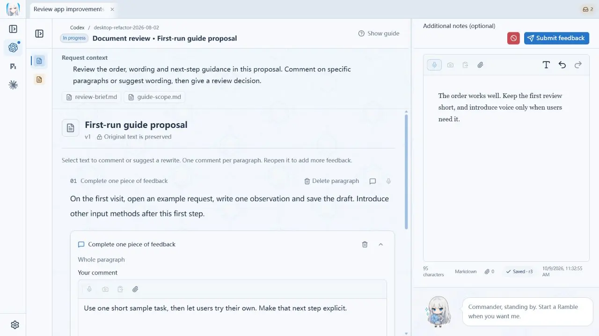
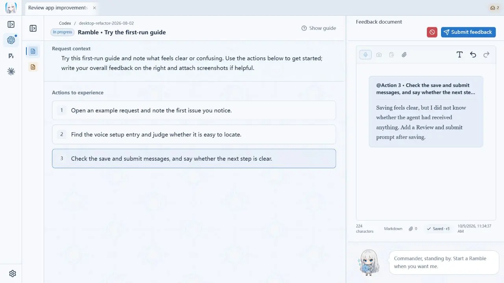
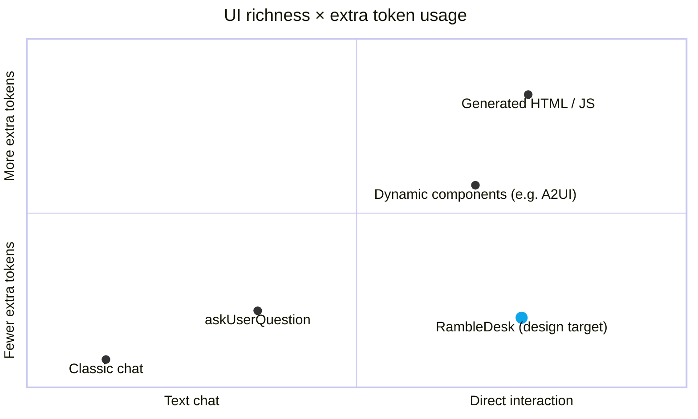

<p align="center">
  <picture>
    <source media="(prefers-color-scheme: dark)" srcset="docs/social/readme-header-dark.webp" />
    <source media="(prefers-color-scheme: light)" srcset="docs/social/readme-header-light.webp" />
    
  </picture>
</p>

<p align="center"><strong>A new interface for working with agents</strong></p>

<p align="center">
  <a href="README.md">English</a> · <a href="README.zh-CN.md">简体中文</a>
</p>

**RambleDesk wants to move collaboration beyond the chat box.**

RambleDesk is a desktop workbench for working with coding agents. When you need to try their work, point out a problem, or decide what happens next, it gives you a place to do that.

The agent explains its progress, presents its work, and tells you what to try or decide. You can mark a problem in an image, comment on a code change, or simply say what you think. RambleDesk gathers your feedback and supporting material so the agent can continue the task.

[Download](https://github.com/l1veIn/rambledesk/releases/latest) · [Get started](#get-started) · [Documentation](docs/README.md)

## What do people do when working with coding agents?

Agents can write code, research a topic, and run tools on their own. But moving a task forward still often needs your involvement:

- **Add context they don't have.** Explain the business background, clarify a requirement, or answer a question.
- **Choose a direction.** Compare approaches, express a preference, or set priorities.
- **Review what they wrote.** Read a plan, a draft, or code, and suggest changes in the relevant places.
- **Try it yourself.** Open a page, use an interface, or run a CLI, and note what works and where you get stuck.
- **Check the result.** Verify table values, details in an image, or a passage in audio or video.

If you've used `askUserQuestion`, you already know one kind of workbench interaction: the agent presents a question and options, asks you to answer, and continues based on your response. RambleDesk's **questions workbench** follows that familiar pattern and extends it to other tasks. Reviewing a document brings up the text and annotation controls; trying a page brings up the page and a place for feedback.

**A workbench prepares the material and controls for a task that needs your input, then collects your response for the agent.** You don't have to turn every judgment into a chat message. Answers, annotations, and attachments return to the agent with your feedback. In sessions started inside RambleDesk, submitting feedback queues the next turn in the original conversation.

### Which workbenches are available?

0.5.0 includes ten workbenches:

| Workbench | What you can do |
| --- | --- |
| Questions | Answer questions one by one, choose options, and add explanations, much like `askUserQuestion` |
| Free feedback | Follow review steps and record feedback with text, voice, and attachments |
| Document review | Annotate paragraphs or selected text and suggest rewrites |
| Image annotation and canvas | Draw arrows, boxes, and text on an image or blank canvas to show where and what to change |
| Web review | View a page and leave comments on specific elements |
| Terminal trials | Use a real CLI, quote its output, and record your experience |
| Drag sorting | Reorder options to express priorities or preferences |
| Diff review | Review code changes and comment on lines, ranges, or hunks |
| Table review | Suggest cell values and add comments |
| Audio and video review | Play the material and leave feedback on a timestamp or segment |

Annotations and proposed rewrites are saved as feedback and suggestions. Actions in a web page or terminal have their usual effects. See the [workbench playground](playground/workbenches/README.md) for more examples.

## Workbench examples

These examples show three **0.5.0** workbenches with demo data.

### Document review: suggest changes beside the original text

Read a plan or draft written by the agent and comment on the relevant paragraph, explaining what should change and why.



### Image annotation: point out what needs changing

Mark an area and explain the adjustment so the agent knows what you're referring to.


### Free feedback: try it, then leave your thoughts

Follow the agent's steps to try the result. Write or speak your observations, and attach supporting material when needed.



You can also add text, voice, and attachments. Optional AI cleanup helps organize your wording while preserving your original feedback. Unfinished feedback is saved as a draft.

## Get started

Download **0.5.0** for **Windows x64** or **macOS Apple Silicon** from [GitHub Releases](https://github.com/l1veIn/rambledesk/releases).

### Start a task inside RambleDesk

1. **Connect an agent.** Open **Settings → Agents**. Follow the prompts to install supported components or connect an existing agent such as Claude Code, Codex CLI, or Gemini CLI. Sign-in and model access belong to the agent itself.
2. **Give it a task.** Start a session, choose an agent and project folder, and describe your goal.
3. **Try it and respond.** When a feedback request arrives, review the result, follow its steps, and submit your comments. Feedback returns to the original conversation so the task can continue.

### Connect your existing agent app or CLI

Open **Settings → External adapters** and follow the [integration guide](docs/COMPATIBILITY.md). How the task continues after delivery depends on the adapter; Generic MCP requires returning to the agent manually.

### Voice and AI cleanup

Text feedback needs no extra setup. For speech, download a local transcription model in **Settings → Voice** and allow microphone access. AI cleanup is optional and needs a separately configured model service.

### Installation and upgrades

The Windows installer is not Authenticode-signed; macOS builds are not notarized. See the [installation guide](docs/INSTALLATION.md).

Before upgrading from 0.4.0, make a complete backup: **0.4.0 cannot open the upgraded database**. See [upgrade and rollback guidance](docs/DATA_COMPATIBILITY.md).

## Why this design?

From ChatGPT to today's coding agents, interfaces have moved into IDEs, terminals, and browsers. We still tend to put our requests, questions, and feedback into a chat box.

As agents take on more work independently, the moments that need human involvement change: trying the result, adding context the agent lacks, or choosing between possible directions.

RambleDesk organizes interaction around those moments. It brings the current work, the questions that need your judgment, and your feedback together, giving each review a clear focus and a path back to the original task.

It suits a workflow where the agent works independently and you step in at meaningful points to try the result and give feedback.

## Where RambleDesk fits

**How many extra tokens does an agent need to provide richer interaction?** The horizontal axis shows UI richness; the vertical axis shows the extra token usage introduced to provide the interface.



RambleDesk aims for the lower right: **reuse built-in workbenches so the agent supplies materials and parameters, and people can review, annotate, and try the result directly.** The model does not need to write an interface for each feedback request. Interaction is shaped by the available workbenches; dynamically generated interfaces can compose components or layouts as needed.

Classic chat provides the zero baseline for UI generation overhead. Tool definitions, parameters, and UI descriptions can still consume tokens. **Positions illustrate design intent, not measured results**, and vary by implementation and task; total token usage for the full task needs separate measurement.

[A2UI](https://a2ui.org/introduction/what-is-a2ui/) describes dynamic components and data. [AG-UI](https://docs.ag-ui.com/introduction) connects events and state without requiring HTML generation. [MCP Apps](https://github.com/modelcontextprotocol/ext-apps) can host prebuilt interfaces. The latter two are described outside the chart because their costs depend on the implementation.

See [interaction approaches and related research](docs/INTERACTION_LANDSCAPE.md) for measurement definitions, more implementations (including CopilotKit, assistant-ui, and Chainlit), and five related papers.

## Run from source

Install Git, Node.js, pnpm, Rust, and your platform's Tauri dependencies, then run:

```bash
git clone https://github.com/l1veIn/rambledesk.git
cd rambledesk
pnpm install --frozen-lockfile
pnpm dev
```

See [development setup](docs/DEVELOPMENT.md), [agent setup and recovery](docs/ACP_MANAGED_SESSIONS.md), the [workbench playground](playground/workbenches/README.md), or the [documentation index](docs/README.md).

## Thanks

- [Codeg](https://github.com/xintaofei/codeg): ACP integration, agent conversations, settings, and appearance references
- [Snow Shot](https://github.com/mg-chao/snow-shot): the screenshot stack
- [RepoChan](https://github.com/l1veIn/repochan-mono): brand and character assets
- [Kotone](https://github.com/l1veIn/kotone): the local speech stack this workbench grew from

## License

[MIT](LICENSE). Adapted code and other third-party components retain their respective licenses; see [third-party notices](THIRD_PARTY_NOTICES.md).

<p align="center">
  
</p>
