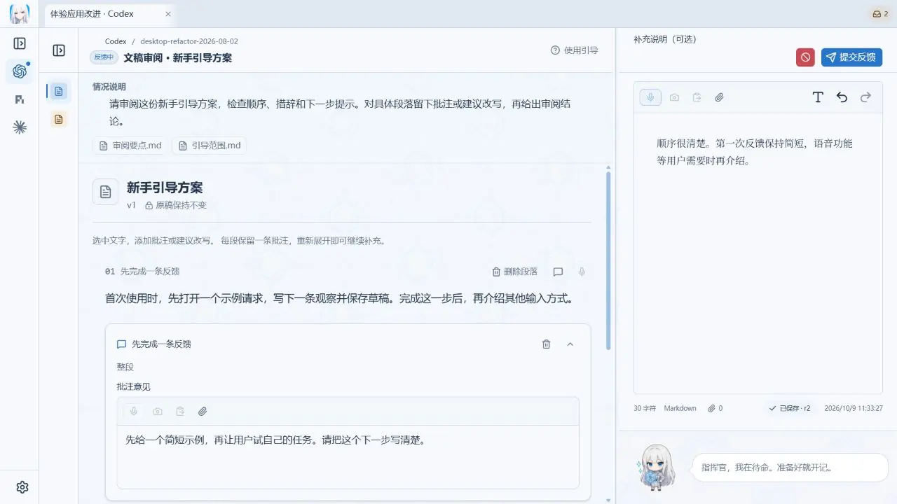
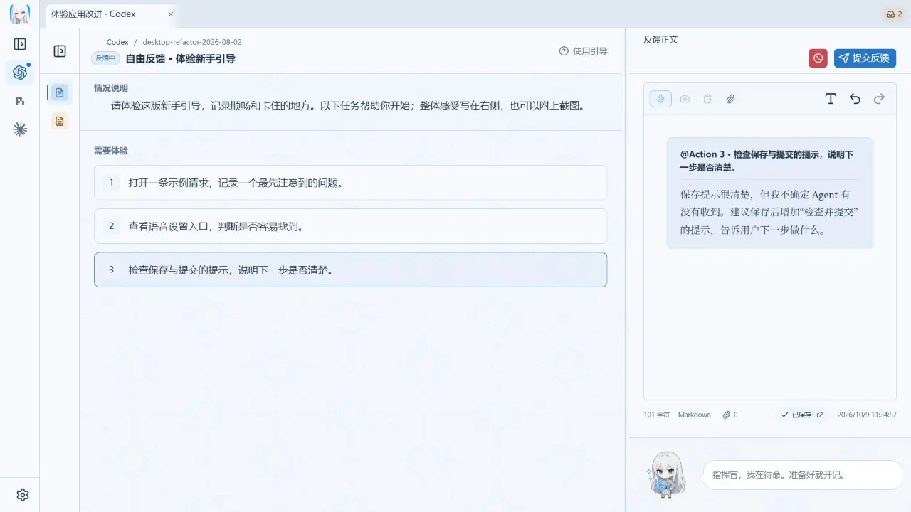
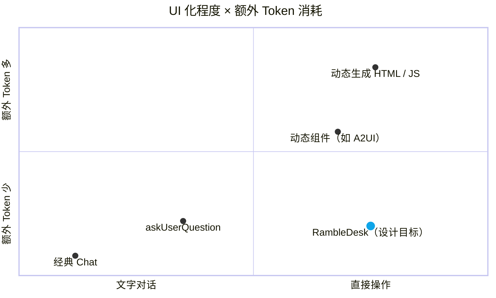

<p align="center">
  <picture>
    <source media="(prefers-color-scheme: dark)" srcset="docs/social/readme-header-dark.webp" />
    <source media="(prefers-color-scheme: light)" srcset="docs/social/readme-header-light.webp" />
    
  </picture>
</p>

<p align="center"><strong>一个与 Agent 协作的新界面</strong></p>

<p align="center">
  <a href="README.md">English</a> · <a href="README.zh-CN.md">简体中文</a>
</p>

**RambleDesk，尝试拿走你的聊天框。**

和编程 Agent 协作时，你经常需要亲自体验结果、指出问题、决定下一步。RambleDesk 为这些需要你参与的时刻，提供一个桌面工作台。

Agent 在工作台里说明当前进展，展示成果，并告诉你需要体验或决定什么。你可以圈出图片中的问题、批注代码改动，或直接说出自己的想法。RambleDesk 汇集反馈与材料，交回 Agent，继续原来的任务。

[下载安装](https://github.com/l1veIn/rambledesk/releases/latest) · [开始使用](#开始使用) · [文档](docs/README.md)

## 和 coding agent 协作，人需要做些什么？

Agent 可以自己写代码、查资料、运行工具，但推进任务时，仍然经常需要你参与：

- **补充它不知道的事。** 解释业务背景、澄清需求、回答一个问题。
- **决定往哪个方向做。** 比较方案、选择偏好、排列优先级。
- **审阅它写出的内容。** 检查方案、文稿和代码，在具体位置提出修改意见。
- **亲自试一试。** 打开页面、操作界面、运行 CLI，记录哪里顺畅、哪里卡住。
- **核对结果。** 检查表格里的值、图片中的细节，或音视频中的某个片段。

如果你用过 `askUserQuestion`，就已经熟悉一种工作台交互：Agent 带着问题和选项请你回答，再根据答案继续。RambleDesk 的**问答工作台**沿用这个直觉，并把同样的方式扩展到其他工作：需要读文稿，就提供文稿和批注；需要体验页面，就提供页面和反馈入口。

**工作台就是为一次具体的人类参与，准备好材料、操作方式和返回结果。** 你不用把所有判断都重新组织成一段聊天消息；答案、批注和附件会随反馈一起交回 Agent。在 RambleDesk 内开始的会话中，提交反馈会续接原来的对话。

### 现在有哪些工作台？

0.5.0 提供以下十种工作台：

| 工作台 | 你可以做什么 |
| --- | --- |
| 问答 | 像 `askUserQuestion` 一样逐项回答，选择选项并补充说明 |
| 自由反馈 | 按体验步骤操作，用文字、语音和附件记录意见 |
| 文稿审阅 | 对段落或选中文字批注，提出建议改写 |
| 图片标注与画布 | 在图片或空白画布上画箭头、框和文字，说明位置与改法 |
| 网页评审 | 查看页面，对具体网页元素留下批注 |
| 终端试用 | 实际操作 CLI，引用输出并记录体验 |
| 拖动排序 | 调整候选项顺序，表达优先级或偏好 |
| 差异评审 | 审阅代码差异，对行、范围或分块批注 |
| 表格审阅 | 对单元格提出建议值和批注 |
| 音视频审阅 | 播放材料，对时间点或片段留下意见 |

批注和改写记录为反馈与建议；网页、终端等体验操作本身按你实际执行的动作运行。更多示例见[工作台 Playground](playground/workbenches/README.md)。

## 工作台示例

下面用演示数据展示 **0.5.0** 的三种工作台。

### 文稿审阅：对着原文提出修改意见

阅读 Agent 写的方案或文稿，在对应段落留下批注，说明哪里需要改、为什么。



### 图片标注：指出哪里需要调整

圈出一个区域，直接说明改法，让 Agent 知道你指的是哪里。


### 自由反馈：试过之后，把想法留下来

跟着 Agent 给出的步骤体验结果，直接写下或说出自己的观察，必要时附上材料。



也可以用文字、语音和附件补充意见。可选的 AI 整理帮助你组织表达，原始反馈会保留；暂时没写完的内容会作为草稿保存。

## 开始使用

从 [GitHub Releases](https://github.com/l1veIn/rambledesk/releases) 下载 **0.5.0**，支持 **Windows x64** 和 **macOS Apple Silicon**。

### 在 RambleDesk 里开始任务

1. **连接 Agent。** 打开「设置 → Agents」，按提示安装支持的组件，或连接已有的 Claude Code、Codex CLI、Gemini CLI 等 Agent。登录与模型访问由 Agent 自身提供。
2. **给它一个任务。** 新建会话，选择 Agent 和项目目录，输入目标。
3. **体验并反馈。** 收到反馈请求后，查看成果、按步骤体验，再提交意见。反馈会回到原对话，继续当前任务。

### 接入你现有的 Agent 应用或 CLI

打开「设置 → 外部适配器」，按[接入指南](docs/COMPATIBILITY.md)配置。反馈送达后的继续方式取决于适配器；通用 MCP 需要你手动回到 Agent 继续。

### 语音和 AI 整理

文字反馈无需额外配置。需要语音输入时，在「设置 → 语音」下载本地转写模型，并允许麦克风访问。AI 整理是可选功能，需要单独配置模型服务。

### 安装与升级

Windows 安装包暂未做 Authenticode 签名，macOS 尚未公证，详见[安装指南](docs/INSTALLATION.zh-CN.md)。

从 0.4.0 升级前，请完整备份数据：**0.4.0 无法打开升级后的数据库**。备份和回退方法见[数据兼容说明](docs/DATA_COMPATIBILITY.md)。

## 为什么这样设计？

从 ChatGPT 到今天的编程 Agent，界面走进了 IDE、终端和浏览器。与它们协作时，我们仍然习惯把需求、问题和反馈放进聊天框。

随着 Agent 能够自主推进更多工作，人参与的时刻也会发生变化：体验它做出的结果、补充它不知道的情况，或在几个方向之间作出判断。

RambleDesk 尝试围绕这些时刻组织交互。工作台把当前成果、需要你确认的事项和反馈放在一起，让每次参与都有明确的对象，也能回到原来的任务里。

它适合让 Agent 自主推进、由你阶段性体验和反馈的工作方式。

## RambleDesk 在这张地图上的位置

**获得更直接的图形交互，需要 Agent 额外花多少 Token？** 横轴是 UI 化程度，纵轴是为提供交互界面额外引入的 Token 开销。



RambleDesk 的目标是右下方：**复用做好的工作台，让 Agent 提供材料和参数，人就能直接审阅、标注和试用。** 模型无需为每次反馈重新编写交互界面，代价是交互形式由已有工作台提供；动态生成界面则可以按需组合组件或编写布局。

图中以经典 Chat 无需生成 UI 作为零基线；工具定义、参数和界面描述仍可能消耗 Token。**点位是设计示意，非实测数据**，具体位置随实现和任务变化；完整任务的 Token 总量需要另行测量。

[A2UI](https://a2ui.org/introduction/what-is-a2ui/) 描述动态组件与数据；[AG-UI](https://docs.ag-ui.com/introduction) 负责事件和状态连接，不要求生成 HTML；[MCP Apps](https://github.com/modelcontextprotocol/ext-apps) 可以承载预制界面。后两者的成本取决于具体实现，因此放在图外说明。

更多实现、计量口径和五篇论文见[交互方案与相关研究](docs/INTERACTION_LANDSCAPE.zh-CN.md)，其中也介绍了 CopilotKit、assistant-ui 和 Chainlit。

## 从源码运行

准备 Git、Node.js、pnpm、Rust 和对应平台的 Tauri 构建依赖后：

```bash
git clone https://github.com/l1veIn/rambledesk.git
cd rambledesk
pnpm install --frozen-lockfile
pnpm dev
```

更多说明：[开发环境](docs/DEVELOPMENT.md) · [Agent 配置与恢复](docs/ACP_MANAGED_SESSIONS.md) · [工作台 Playground](playground/workbenches/README.md) · [文档索引](docs/README.md)

## 致谢

- [Codeg](https://github.com/xintaofei/codeg)：ACP 接入、Agent 对话、设置与外观设计参考
- [Snow Shot](https://github.com/mg-chao/snow-shot)：截图能力
- [RepoChan](https://github.com/l1veIn/repochan-mono)：品牌与角色资产
- [Kotone](https://github.com/l1veIn/kotone)：本地语音转写的实现基础

## 许可证

[MIT](LICENSE)。改写代码及其他第三方组件保留各自许可证，详见[第三方声明](THIRD_PARTY_NOTICES.md)。

<p align="center">
  
</p>
