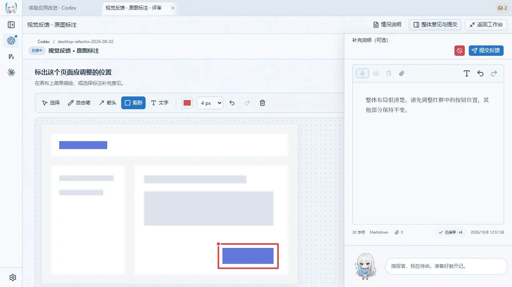
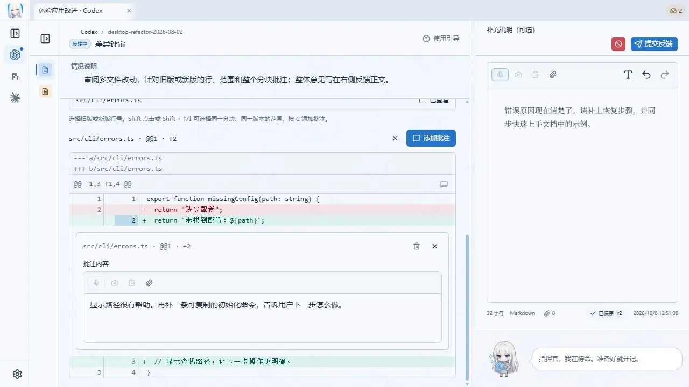
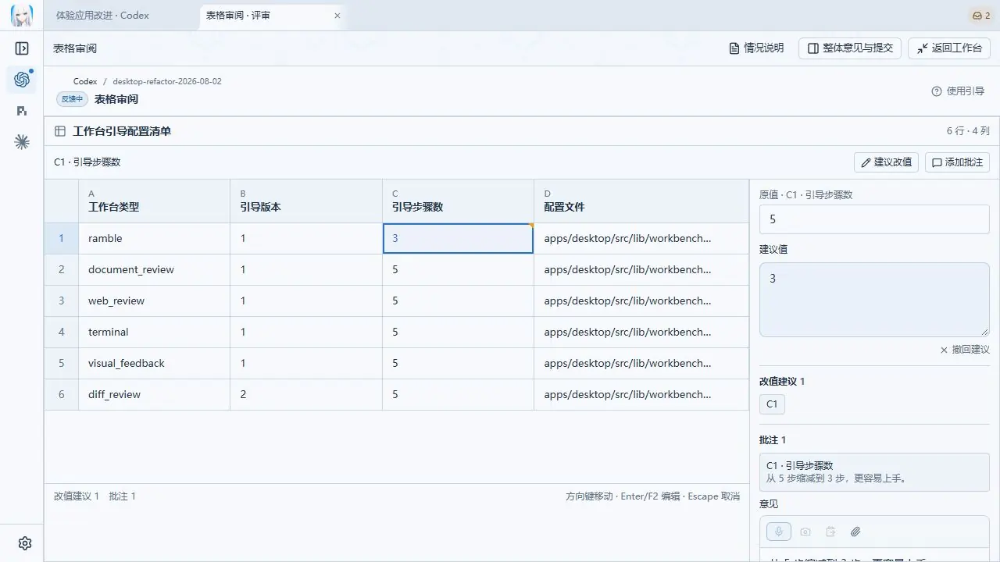

<p align="center">
  <picture>
    <source media="(prefers-color-scheme: dark)" srcset="docs/social/readme-header-dark.webp" />
    <source media="(prefers-color-scheme: light)" srcset="docs/social/readme-header-light.webp" />
    
  </picture>
</p>

<p align="center"><strong>一个与 Agent 协作的新界面</strong></p>

<p align="center">
  <a href="README.md">English</a> · <a href="README.zh-CN.md">简体中文</a>
</p>

**RambleDesk，尝试拿走你的聊天框。**

和编程 Agent 协作时，你经常需要亲自体验结果、指出问题、决定下一步。RambleDesk 为这些需要你参与的时刻，提供一个桌面工作台。

Agent 在工作台里说明当前进展，展示成果，并告诉你需要体验或决定什么。你可以圈出图片中的问题、批注代码改动，或直接说出自己的想法。RambleDesk 汇集反馈与材料，交回 Agent，继续原来的任务。

[下载安装](https://github.com/l1veIn/rambledesk/releases/latest) · [开始使用](#开始使用) · [文档](docs/README.md)

## 一次反馈，怎样继续任务？

比如，你让 Agent 调整一个页面。它完成一轮修改后，请你体验并确认效果。

1. **先看成果和需要确认的事项。** 工作台说明做了什么，以及需要你体验或决定什么。
2. **在对应的位置留下意见。** 圈出位置不合适的按钮，批注相关的代码改动，或者直接说：“整体布局不错，按钮往上挪一点。”
3. **把反馈交回去，接着做。** 意见和附件一起交给 Agent。在 RambleDesk 内开始的会话中，提交反馈会续接原来的对话，送达状态也会显示在工作台里。

工作台记录你的意见和修改建议，不会直接改动项目文件。

## 对着成果，给出反馈

下面用演示数据展示 **0.5.0** 的图片标注、代码评审和表格审阅。

### 图片：指出哪里需要调整

圈出一个区域，直接说明改法，让 Agent 知道你指的是哪里。



### 代码：把意见留在改动旁边

对着具体的改动行评论，保留问题发生的位置和上下文。



### 表格：提出具体的修改建议

在对应的单元格填写建议值，并解释原因。



也可以用文字、语音和附件补充意见。可选的 AI 整理帮助你组织表达，原始反馈会保留；暂时没写完的内容会作为草稿保存。

## 开始使用

从 [GitHub Releases](https://github.com/l1veIn/rambledesk/releases) 下载 **0.5.0**，支持 **Windows x64** 和 **macOS Apple Silicon**。

### 在 RambleDesk 里开始任务

1. **连接 Agent。** 打开「设置 → Agents」，按提示安装支持的组件，或连接已有的 Claude Code、Codex CLI、Gemini CLI 等 Agent。登录与模型访问由 Agent 自身提供。
2. **给它一个任务。** 新建会话，选择 Agent 和项目目录，输入目标。
3. **体验并反馈。** 收到反馈请求后，查看成果、按步骤体验，再提交意见。反馈会回到原对话，继续当前任务。

### 接入你现有的 Agent 应用或 CLI

打开「设置 → 外部适配器」，按[接入指南](docs/COMPATIBILITY.md)配置。反馈送达后的继续方式取决于适配器；通用 MCP 需要你手动回到 Agent 继续。

### 语音和 AI 整理

文字反馈无需额外配置。需要语音输入时，在「设置 → 语音」下载本地转写模型，并允许麦克风访问。AI 整理是可选功能，需要单独配置模型服务。

### 安装与升级

Windows 安装包暂未做 Authenticode 签名，macOS 尚未公证，详见[安装指南](docs/INSTALLATION.zh-CN.md)。

从 0.4.0 升级前，请完整备份数据：**0.4.0 无法打开升级后的数据库**。备份和回退方法见[数据兼容说明](docs/DATA_COMPATIBILITY.md)。

## 为什么这样设计？

从 ChatGPT 到今天的编程 Agent，界面走进了 IDE、终端和浏览器。与它们协作时，我们仍然习惯把需求、问题和反馈放进聊天框。

随着 Agent 能够自主推进更多工作，人参与的时刻也会发生变化：体验它做出的结果、补充它不知道的情况，或在几个方向之间作出判断。

RambleDesk 尝试围绕这些时刻组织交互。工作台把当前成果、需要你确认的事项和反馈放在一起，让每次参与都有明确的对象，也能回到原来的任务里。

它适合让 Agent 自主推进、由你阶段性体验和反馈的工作方式。

## 从源码运行

准备 Git、Node.js、pnpm、Rust 和对应平台的 Tauri 构建依赖后：

```bash
git clone https://github.com/l1veIn/rambledesk.git
cd rambledesk
pnpm install --frozen-lockfile
pnpm dev
```

更多说明：[开发环境](docs/DEVELOPMENT.md) · [Agent 配置与恢复](docs/ACP_MANAGED_SESSIONS.md) · [工作台 Playground](playground/workbenches/README.md) · [文档索引](docs/README.md)

## 致谢

- [Codeg](https://github.com/xintaofei/codeg)：ACP 接入、Agent 对话、设置与外观设计参考
- [Snow Shot](https://github.com/mg-chao/snow-shot)：截图能力
- [RepoChan](https://github.com/l1veIn/repochan-mono)：品牌与角色资产
- [Kotone](https://github.com/l1veIn/kotone)：本地语音转写的实现基础

## 许可证

[MIT](LICENSE)。改写代码及其他第三方组件保留各自许可证，详见[第三方声明](THIRD_PARTY_NOTICES.md)。

<p align="center">
  
</p>
