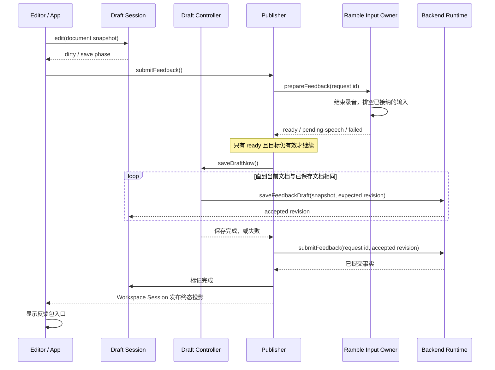

# 从编辑到反馈包：一条可以读懂的反馈链

这次整理以 `v0.4.0-rc.3` 为起点，沿当前 Feedback Draft 的输入准备、编辑、保存、提交和反馈包展示阅读。
它继续使用现有 Svelte store、Application Transport 和 Rust 后端，没有增加另一套业务事实。
术语与持久化合同遵循 [TERMINOLOGY.md](TERMINOLOGY.md) 和 [ARCHITECTURE.md](ARCHITECTURE.md)。
全项目职责与其他示范入口见 [质量阅读地图](quality/QUALITY_WALKTHROUGH.md)；本文保留这条反馈链的细节。

## 先看完整的动作



Cooking 开启时，Publisher 在保存与发布之间请求一个独立的 Markdown 变体；原始结构化文档始终保留。

## 1. 状态有一个写入位置，也有一个清楚的读取出口

从 [workspaceSession.ts](../apps/desktop/src/lib/workbench/workspaceSession.ts) 的 `project` 开始读。

```ts
const submitting = facts.submitStage !== 'idle'
```

`submitting` 从阶段得出。外部只能设置阶段，无法分别把“正在提交”设为 false、又把阶段留在 publishing。
`interactionLocked` 和 `feedbackResult` 也由同一投影产生，UI 通过 `$workspaceSession` 订阅。

[draftSession.ts](../apps/desktop/src/lib/workbench/draftSession.ts) 同样把 `dirty` 放进只读投影：

```ts
dirty: facts.documentJson !== facts.savedDocumentJson
```

这些派生值不会被独立写入。源事实改变时，投影随之改变，组件不必知道内部如何计算。

rc3 原来的 `$: feedbackResult = workspaceSession.feedbackResult()` 隐藏了 store 依赖。
如今 [App.svelte](../apps/desktop/src/App.svelte) 显式读取 `$workspaceSession.feedbackResult`，
这种正确的读取方式成为接口的正常用法。保存标签也显式接收 phase、revision 和 locale，避免同样的隐藏依赖。

**可以欣赏的地方：接口替调用方记住规则，减少需要靠经验避免的错误。**

## 2. “保存完成”是一项承诺

接着读 [draftController.ts](../apps/desktop/src/lib/workbench/draftController.ts) 的
`saveDraftNow` 和 `drainSaves`。

调用方等待的是整个保存过程。保存期间又有新编辑，Controller 使用后端刚确认的 revision 继续保存；
多个调用方共享同一个 Promise，得到同一批保存的成功或失败结果。

一个容易忽略的例子：

| 时刻 | 编辑器内容 | 当前已知的服务器内容 | 正在发送 |
| --- | --- | --- | --- |
| 起初 | O | O | 无 |
| 编辑后保存 | A | O | A |
| 用户撤回 | O | O | A |
| A 保存成功 | O | A | 需要再保存 O |

第三行看起来 `dirty === false`，却不能宣称保存完成，因为在途请求还会改变服务器事实。
因此代码先等待 `activeSave`，再判断是否需要写入。这个顺序就是接口承诺的一部分。

保存失败时，所有等待者获得 false，草稿和错误留在界面；失败不会被另一位等待者偷偷重试。
用户下一次编辑或明确重试可以开启新的保存过程。旧请求的错误也不会覆盖新请求的草稿状态。

保存成功后的应用事件还会触发 workspace refetch。[导航 owner](../apps/desktop/src/lib/workbench/workspaceNavigationController.ts)
核对请求、revision 和结构化文档后，原地协调相同文档，保留当前 Editor、光标和撤销历史；读取期间新增
的本地输入也不会被保存基线覆盖。真正改变的远端文档继续走原加载流程。
[真实 App 事件流测试](../apps/desktop/src/App.editorRefresh.test.ts) 验证自动保存后仍能点击 Undo/Redo，
红绿证据和迟到响应边界见[质量清单](quality/README.md)。

**可以欣赏的地方：调用方只需等待一次，复杂的并发顺序集中在一个能独立验证的位置。**

## 3. 一个提交命令负责到底

[publisherController.ts](../apps/desktop/src/lib/workbench/publisherController.ts) 对外只提供 `submitFeedback()`。
它直接使用现有 Workspace、Draft 和 Cooking Session，App 不再传入一袋逐项修改状态的 setter。

阅读 `runSubmission`，可以按顺序看到：

1. 检查终态、只读限制和正在进行的操作。
2. 等输入 owner 结束录音、排空已接纳的语音与剪贴板写入，并取得明确准备结果。
3. 锁定编辑和工作区切换，等待保存完成。
4. 固定请求、正文和后端确认的 revision。
5. 按需取得 Cooking 结果，再发布。
6. 应用后端返回的终态，读取反馈包，并释放本次操作持有的状态。

`activeSubmission` 在异步准备开始前就被占用，连续点击加入同一次提交。
语音落稿完成后才锁定编辑，保证停止录音时的最后一段内容仍能通过既有文档队列写入。

输入方的公开合同见 [RambleSessionControllerHandle](../apps/desktop/src/lib/speech/rambleSessionControllerHandle.ts)：

```ts
prepareFeedback(requestId): Promise<
  | { kind: 'ready' }
  | { kind: 'pending-speech' }
  | { kind: 'failed'; message: string }
>
```

Publisher、Cooking 预览和批准/取消都调用这一动作。App 无需分别读取 `hasPendingSpeech`、
`speechStopError`，再自行拼接 exit、speech queue、document queue 的等待顺序。
[Ramble Session](../apps/desktop/src/lib/workbench/rambleSession.ts) 订阅麦克风原始 store 并提供只读投影，
录音字段不再通过多项双向绑定绕经 App；组件位于 locale key 外，切换语言不会重建麦克风 owner。

`exitRamble` 的独立 `exitFlight` 表达“结束并排空”这个意图。若录音仍在启动，先等 start，然后真正停止，
不会把“启动完成”当成“退出完成”。准备期间新接纳的 clipboard import 也进入同一次排空；它的失败
必须返回 failed，不能因它比最初的检查晚到就被遗漏。实现与先红后绿证据见
[质量清单](quality/README.md)与[反馈验收方法](quality/FEEDBACK_ACCEPTANCE.md)。

Cooking 的接口是 `cookSubmission(savedSubmission) → CookingPreview`。
它返回结果和来源，不回调 Publisher。Publisher 负责发布和错误收尾。
已有预览还要匹配 request id、saved revision 和原文，防止把旧预览配上新的保存版本提交。

**可以欣赏的地方：动作的开始、等待、成功与失败在一处能够读完；每一层只承诺自己能负责的事。**

## 4. 成功事实不会被后续读取失败抹掉

`submitFeedback` 成功返回后，反馈已经由后端提交。接下来的 `readPublishedFeedback` 或导航刷新失败，
只会报告读取问题，终态和反馈包入口仍保留，也不会再次发布。下载入口可以重新读取真实反馈包。

客户端不会拿手中的字符串伪装成已发布内容。`document_json` 仍是原稿真源，Markdown 是投影与交付格式，
后端 revision/CAS 仍负责多客户端并发仲裁。

**可以欣赏的地方：代码尊重事情真实发生的先后关系，错误不会改写已经完成的事实。**

## 5. 测试穿过这些接口

- [App.feedbackFlow.test.ts](../apps/desktop/src/App.feedbackFlow.test.ts) 挂载真实 App 与 TipTap，
  检查编辑、保存标签、提交版本、页签锁、反馈包入口以及失败重试。
- [draftController.test.ts](../apps/desktop/src/lib/workbench/draftController.test.ts) 控制后端响应时机，
  验证保存期间的新编辑、撤回、并发等待、失败与请求切换。
- [publisherController.test.ts](../apps/desktop/src/lib/workbench/publisherController.test.ts) 使用真实 Session
  和 Draft Controller，验证完整提交、重复点击、Cooking 与发布后读取失败。
- [rambleInputController.test.ts](../apps/desktop/src/lib/workbench/rambleInputController.test.ts) 挂载真实
  Ramble 组件，验证延迟启动、最终语音、排空期间新 import、参与写入失败和销毁后的候选处置。

真实组件测试曾直接发现“后台已保存，但保存标签还停留在旧版本”的问题。
这说明测试正在验证用户能观察到的行为，能跨过各模块独立测试之间的空隙。

## 验证边界

这条示范已使用真实 App/TipTap 测试，以及隔离 HTTP/SQLite 夹具中的编辑、保存、刷新、提交与包哈希核对验证。浏览器窄视口不等于手机真机，协议夹具不等于真实 Agent。各阶段结果和剩余验收统一见[质量清单](quality/README.md)，不在教程中维护重复的测试数量和总评分。

## 如何评价这次整理

读完后，可以用三个具体问题评价它：

- 想改变保存策略，是否主要阅读 Draft Controller 即可？
- 想了解一次提交如何成功或失败，是否能沿 Publisher 的单一路径读完？
- 改变内部实现后，描述用户行为的测试是否仍然有意义？

这条链的示范价值在这些问题上。后续语音状态与导航 owner 已按现有边界收拢，阅读入口与证据见
[质量阅读地图](quality/QUALITY_WALKTHROUGH.md)。Windows、手机真机及用户交互确认仍按质量清单待验，
这份示范不代表整个前端已经达到满分，也不代表全计划完成。
