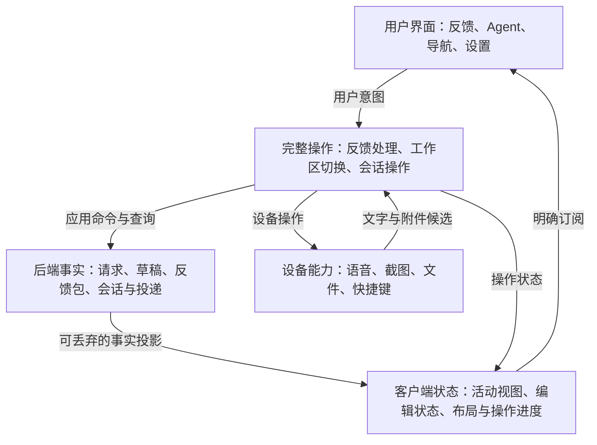

# RambleDesk 全局质量收敛计划

> 制定日期：2026-09-09。
> 状态：用户已授权执行；M1–M4 工程实现及组合回归已落地，已测交互达到预算，M5 长期资源观察与 M6 必验项仍有缺口。全计划尚未完成，实际结果见第 8 节。
> 使命：让一个业务本质清楚的桌面应用，拥有同样清楚、可靠、容易修改的代码与用户体验。
> 本文覆盖当前产品范围内的整体质量提升；commit 清单保留建议交付顺序，实际提交见第 8 节；本轮未发布。

## 1. 前情提要与起点

### 1.1 这轮讨论如何走到这里

1. 起点是比较 `0.4.0-rc.2` 与 `0.4.0-rc.3`，评价 rc3 的移动适配与代码结构优化。两版之间有 35 个 commit。
2. 当时对 rc3 给出约 **7/10 的综合评价**：宏观架构约 8 分，移动适配显著进步，但状态传播、跨模块操作与真实体验的成熟度不均匀。这个分数是基于审阅和验证的工程判断，不是自动计算的指标。
3. 用户追问达到 10 分是否需要大手术，以及项目中是否仍有大量不够优雅的实现。
4. 双方选择 **编辑 → 保存 → 提交 → 反馈包展示与下载**，完成了一条实际示范。它修复了用户可见的回归，也收拢了状态与操作职责。
5. 用户认可示范的标准：**只创建必要的实体，数据和指令流动清楚，整个流程能够顺着读完。** 随后明确要求回到全局视野，以整个项目的质量为目标。
6. 本计划把这一标准扩展为有范围、有依赖、有完成条件的整体工作。导航、语音等是实施位置，整体质量才是目标。

### 1.2 版本和工作区基线

以下 SHA 均为 tag 解引用后的 commit，不是 annotated tag 对象的 SHA。

| 对象 | 制定计划时的状态 |
| --- | --- |
| `v0.4.0-rc.2` | `d631ea34d9185fd5baf78b834f5dd366d88879f4` |
| `v0.4.0-rc.3` / HEAD | `b7ab9d088aa2a67322e8ee9b1c697efe9075f1ce` |
| 当前分支 | `codex/acp-managed-sessions` |
| 反馈闭环示范 | 制定计划时为 HEAD 之上的未提交改动，包含实现、测试和导读 |
| 评分口径 | rc3 标签与示范后的工作区分别记录，不能把后者的修复算作原 rc3 已具备的质量 |

开始实施时重新核对 HEAD、工作树与已有交付；已经完成的示范直接承接，不从旧 tag 重做，也不覆盖后续出现的无关改动。

### 1.3 已完成的示范与证据

详细说明见 [反馈链路导读](FEEDBACK_FLOW_WALKTHROUGH.md)。已完成：

- Workspace / Draft 的派生状态通过明确的订阅出口读取，修复反馈包入口、操作锁和保存标签不及时更新的问题。
- `saveDraftNow()` 等待整个保存过程，处理在途保存、新编辑、撤回和共享失败结果。
- Publisher 负责语音准备、保存、冻结版本、可选 Cooking、发布和收尾；重复点击加入同一次提交。
- Cooking 结果携带请求、保存版本及原文来源；原始结构化草稿保持独立。
- 发布成功后的读取失败保留已提交事实，避免重复发布。

2026-09-09 的本地证据：

| 证据 | 已验证结果 | 证明范围 |
| --- | --- | --- |
| 前端全套测试 | 191 个文件、1231 条测试通过 | 示范时点的历史基线；不是最终工作区结果或数量指标 |
| 类型、构建和门禁 | 类型检查 0 errors / 0 warnings；Web build、前端大小、术语与核心边界、diff 检查通过 | 构建仍有主 bundle 大于 500 kB 的提示；未证明运行性能 |
| 真实 App + TipTap | 编辑保存与发布、提交中页签锁、保存失败保留内容并重试 | 挂载组件与内存 transport 的组合行为 |
| 浏览器 + HTTP + SQLite | 普通宽度和 390 × 844 视口完成编辑、保存、发布、下载 | 二级标题刷新后恢复；版本及包内容一致；下载正文和 manifest 的 SHA-256 已核对 |
| 验证宿主 | 临时独立数据库；最新前端构建；链接本机已有 workspace Rust 构建产物 | 实际 HTTP、facade 和存储路径；不等于正式安装包或真实 Agent 验收 |

上述示范时点尚未验证真实录音设备、Cooking 模型与手机真机。后续本轮真实 Cooking 已通过，夹具已固化；最新结果见第 8 节与各验收记录，不以历史快照覆盖当前状态。

## 2. 使命、目标与范围

### 2.1 使命

让人类放心地把反馈交给 RambleDesk，也让维护者能从少量清楚的入口理解和修改它。

产品核心闭环保持为：

**Agent 提出请求 → 人类形成反馈 → 保存并发布反馈包 → Agent 继续工作。**

语音、截图、会话管理、设置与浏览器访问围绕这个闭环服务。设备、并发和恢复产生的必要复杂度，由对应模块承担。

### 2.2 本轮目标

| 目标 | 可观察的最终变化 |
| --- | --- |
| 状态可信 | 每项共享事实有一个所有者；派生值随源事实更新；UI 显示与操作实际状态一致 |
| 操作完整 | 调用方表达用户意图；负责模块处理等待、身份检查、成功、失败和收尾 |
| 修改局部 | 改一种业务行为，主要阅读与修改负责它的模块；无需追踪一串字段 setter |
| 内容可靠 | 保存、切换、输入、提交、重连与重启保护草稿、附件和会话归属 |
| 体验一致 | 加载、忙碌、失败、重试、终态及焦点行为在各页面可理解、可预期 |
| 验证匹配承诺 | 自动化、真实浏览器、真实后端、真实设备各自提供对应层级的证据 |

### 2.3 保留的架构资产

以 [术语](TERMINOLOGY.md)、[产品](PRODUCT.md)、[架构](ARCHITECTURE.md) 为准，本计划不另造术语体系。

- 共享 Workbench Client、typed Application Transport，以及独立的 Native / Browser Capability。
- 一个 Backend Runtime 持有业务事实；Tauri 与 HTTP 调用同一 application 合同。
- 每个 Workbench Client 最多一个可编辑 Editor；`document_json` 是草稿真源，Markdown 是投影与交付格式。
- 后台文档写入继续通过明确 request id、结构化变换、串行队列和后端 revision/CAS。
- 不可变反馈包、持久发布计划、终态与投递记录的一致性保障。
- 外部宿主与托管 Agent 的身份隔离；prepared / active 生命周期和固定会话归属。
- 关闭正式会话视图与停止运行分开；未知投递结果保留显式处理路径。
- 平台媒体在输入设备本地处理；语音待确认队列和文档写入队列保留各自职责。

### 2.4 范围边界

本轮整理现有功能的实现和质量，不增加产品业务域。保留 Svelte、Tauri、SQLite、现有 Editor 与包结构。

以下另立项：框架或数据库迁移、通用状态机/任务引擎、动态第三方插件平台、云同步、LAN/TLS 产品化、独立 headless 部署、新浏览器截图能力、Browser ASR 的全面兼容承诺，以及新的 Agent 工具执行引擎。

手机部分沿用 [响应式 Shell](RESPONSIVE_SHELL.md) 的 dogfooding 定位；验收与缺陷修复有明确范围。接入真机时使用已有、明确可用的测试方式，不通过扩大网络产品范围完成本计划。

## 3. 完工后应当看见的全局结构

下图是职责阅读地图，对应现有模块，不要求创建同名的新层或实体。

### 3.1 状态所有权

| 状态 | 所有者与生命周期 | 对外合同 |
| --- | --- | --- |
| 请求、已保存草稿、反馈包、托管会话、投递 | Backend Runtime / SQLite 与发布存储 | 应用查询和显式命令；revision、终态与幂等规则由后端仲裁 |
| 当前编辑内容、已接受保存基线 | 当前 Client 的 Draft Session / Editor | 编辑快照、只读 dirty/save 投影、明确的保存接受动作 |
| 打开的视图、活动页签、布局偏好 | 当前 Client 的 Workspace / Layout 状态 | 有类型的视图描述与操作；不缓存另一份 canonical 草稿 |
| 语音采集与识别资源 | 当前设备的 Speech Capability / 现有 controller | 启停与事件；UI 通过单一投影读取状态 |
| 待确认语音、文档写入顺序 | 现有语音队列、文档队列 | 各自描述成功、待处理和失败；处理结束不自动等于落稿成功 |
| 一次保存、切换、发布等异步操作 | 负责该操作的模块 | 目标身份、并发规则、失败结果与资源释放均可解释 |
| 简单弹层、展开项、表单局部输入 | 使用它的页面或局部模块 | 保持就近；只有真实共享或独立生命周期才提升归属 |

### 3.2 代码审美的执行标准

1. **接口兑现承诺。** `await` 返回时究竟完成了什么必须明确，不能把开始执行当作完成。
2. **事实与投影分开。** 能推导的状态只有一个定义；普通 getter 可以用于命令内读取，组件依赖必须明确订阅。
3. **一个操作有完整责任。** 目标身份、迟到结果、失败恢复与释放顺序由负责模块管理。
4. **依赖揭示真实关系。** 新模块需要说明隐藏了哪些知识、服务哪些实际调用方；只有转发和改名的拆分不算进展。
5. **复杂度留在有理由的位置。** CAS、发布恢复、进程归属等保障继续保留；简单表单和局部 UI 保持简单。
6. **测试穿过使用接口。** 通过真实状态与行为验证合同，避免用大量 getter/setter mock 重新拼一份实现。

App 最终仍可负责依赖装配、UI 局部状态与渲染；保存—卸载—加载—恢复、输入队列收尾等业务步骤应在负责模块内读完。文件行数只作防退化信号，不作质量终点。

## 4. 阶段、依赖与里程碑

三个工作面贯穿各阶段：**状态与流程收拢、产品行为一致、真实验收**。每项行为变更在自己的提交内包含相关验证；末期集成只补组合缺口。

| 阶段 | 里程碑 | 主要交付 | 开始条件 |
| --- | --- | --- | --- |
| M0 | 基线与示范可复用 | 本计划、已完成示范、隔离验收入口、性能基线 | 当前工作区 |
| M1 | 工作区状态与导航有完整归属 | 共享状态合同、切换与刷新仲裁 | M0 的示范与夹具可用 |
| M2 | 人类输入到终态形成连续合同 | 语音准备、附件写入、取消/批准与 Cooking 分支 | M1；沿用示范保存/发布入口 |
| M3 | Agent 与后端生命周期有组合证据 | prepared 流程整理、持久化及资源故障验证 | 后端验证可在 M0 后开始；前端接线依赖 M1 |
| M4 | 全应用呈现与装配一致 | App 收拢、设置合同、操作反馈、响应式细节 | M1–M3 的状态与操作接口稳定 |
| M5 | 性能与跨模块验收达标 | 测量驱动的优化、剩余高风险根链 | M4；对照 M0 性能基线 |
| M6 | 形成可交付版本与全局复评 | 真实平台/Agent 记录、最终阅读地图、评分与剩余项 | 前述必需验收通过；真实环境可用 |

后端故障验证与前端整理可并行；共享 App / navigation / draft 文件的修改保持串行。性能基线在 M0 建立，M5 只处理测得的问题。

### M0：基线与示范可复用

**工作：**承接已完成示范；复用现有 App 测试、预览与 Rust 验证入口，将临时 HTTP/SQLite 验收整理为可重复的测试设施；记录受测版本、独立数据目录、请求 seed、启动与清理方式。先验证功能，再记录正式构建性能基线。

**完成判据：**

- 现有示范、未来工作、实际 commit SHA 在账本中可区分；已有代码不被重复实现。
- 一个明确入口可以启动隔离服务，执行编辑到下载，核对 SQLite、revision 和包产物，结束后清理进程。
- 设施使用真实 application/server/storage；不会访问日常用户数据库，也不成为新的产品运行入口。
- 固定支持范围、测试平台、性能数据集与测量方法；逐项登记必验、条件验收或观察属性，不可用环境列入待验清单。
- 初始性能基线使用当前可用的主要 Desktop/Web 环境和确定性文档/历史场景；真实录音资源测量在设备验收时补齐，不阻塞 M0 的可重复基线。

### M1：工作区状态与导航有完整归属

**工作：**统一 workbench 其余共享状态的读取与修改方式，保留合理的不同生命周期。沿现有 `workspaceTransition` 收拢打开、切换、关闭、scope 恢复，以及后台 refetch 与用户导航的仲裁。

**完成判据：**

- 保存失败留在原处，草稿、活动页签和导航范围一致；加载失败可恢复原视图。
- 快速 A→B→C 切换时，迟到的 B 不覆盖 C；主动导航优先于已经过期的自动刷新意图。
- 关闭活动视图、后台视图、缺失会话视图，以及 prepared 草稿晋升后的关闭行为可分别解释。
- 当前 Editor 的卸载与加载规则保持；后台写入仍按目标 request id 路由。
- UI 订阅的派生状态有一个生产定义；调用方不负责多个 session 的字段复位顺序。

### M2：人类输入到终态形成连续合同

**工作：**消除语音状态的多次镜像；提供能区分“已落稿、待确认、失败”的提交准备操作。整理截图/文件候选、导入、文档插入、保存与收据；验证取消、批准、Cooking 预览等剩余终态分支。

**完成判据：**

- 停止录音后的最后片段进入正确请求并保存后，才能形成成功收据；待确认语音继续阻止提交。
- 切页、重试与迟到事件不会串请求或重复插入；语音队列的待处理内容保留可恢复身份。
- 附件导入/写入/保存失败不显示虚假成功；失败阶段保留明确的重试或清理路径。
- 临时捕获资源在取消或移交完成后释放；仍供 Editor/附件列表显示的预览 URL，由最后使用者释放、工作区替换或销毁触发回收。订阅随其 owner 的生命周期结束而释放。
- 取消不会触发托管 feedback continuation；Pi/dsh 等外部适配器仍按既有合同返回终态。批准与提交各自遵守终态合同；Cooking 原稿与预览来源保持正确。

### M3：Agent 与后端生命周期有组合证据

**工作：**仅在依赖确实缩小时分离 Agent 发现/安装与 prepared 会话生命周期；保留固定 sessionId 与轻量反馈状态查询。先映射已有 Rust 测试，再补持久化、投递、恢复、删除、启动退出之间缺失的故障窗口。

**完成判据：**

- 配置变化或关闭草稿能回收旧准备资源；首条消息接受与视图晋升只发生一次。
- 接收结果不明时保留输入和明确状态，不自动重发；关闭正式会话视图只释放 Client 资源。
- 同版本多客户端写入、发布响应丢失、发布与删除竞争后，草稿、包、终态和 delivery 一致。
- 旧 instance/turn 回调不能影响新实例；停止/删除只回收所属资源；另一会话继续工作。
- 启动中退出、等待权限时删除、清理失败后重试、重启后恢复均有对应结果与证据。

已有实现通过时保留。只有可复现的问题才驱动事务、锁序、进程或恢复逻辑修改；通过检查不是拆新 crate 的理由。

### M4：全应用呈现与装配一致

**工作：**在 owner 稳定后收拢 App 的启动、装配和清理；统一设置入口与共享合同；逐页核对忙碌、失败、重试、空状态和终态。修复响应式适配已发现的安全区与小点击目标问题，再以交互验收确认结果。

**完成判据：**

- App 中不再实现完整业务步骤或手动排空多个输入队列；客户端启停有清楚的生命周期入口。
- 销毁后的异步结果不写入新 Client；页面关闭与 Agent 运行停止继续分开。
- 设置标题、定位、能力可用性和语言切换一致；简单表单保持就近管理。
- 操作状态准确，重复错误不淹没界面，失败动作有明确恢复入口；UI 只展示用户需要的实现信息。
- 普通宽度、平板和手机视口不串布局偏好；抽屉焦点、键盘操作、触控目标和安全区通过对应检查。
- 手机真机键盘与旋转单列证据；浏览器模拟通过不能替代该项。

### M5：性能与跨模块验收达标

**工作：**对照 M0 数据测量启动、输入、切换、历史与长时间运行；只优化已确认的主要瓶颈。复用各阶段测试，补齐恢复/重新认证及附件后提交等真正缺失的跨模块路径。

**完成判据：**

- 优化前后使用相同构建模式、设备和数据集；报告样本数、中位数与尾部值。
- 既有性能预算满足，且优化没有改变保存、焦点、历史或资源归属合同。
- 高频流程从真实 UI 意图到后端结果一致；已覆盖场景不为增加数量而重复造测试。
- 未发现值得优化的瓶颈时记录结果并跳过优化提交。

### M6：可交付版本与全局复评

**工作：**使用明确的构建产物完成既有 Desktop/Web 支持范围内的实际验收；选择版本固定的现有 Agent 接入验证闭环；更新实际架构、支持矩阵和本计划账本。复评只使用最终受测版本的证据。

**完成判据：**

- 主要正常路径和高风险中断路径有相称证据；第 6.2 节的必验项全部通过，条件验收和观察项按各自规则记录。
- 当前候选构建的安装、升级、启动退出与资源释放符合既有发行合同；不用一次网页验收代替安装包验收。
- 真实 Agent 完成请求、提交、继续、第二轮与原会话恢复；握手、模型回复、反馈闭环分别记录。
- 文档中的 CURRENT、测试入口和支持状态与实际代码一致；旧例外与重复状态定义按实际消除情况清理。
- 给出最终评分、剩余风险和是否结束本轮的结论。完成计划不自动承诺发布、打 tag 或获得 10 分。

## 5. 建议 commit 清单

编号表示可独立审阅的交付单元。实现、对应行为测试和必要合同更新同提交；下表不规定最终 Git 数量。
紧密耦合的单元可以合并，过大的单元可沿完整行为拆分，并更新依赖。已覆盖、无需修改的验证项记录证据后跳过空提交。

| 编号 | 阶段 | 建议标题 | 交付内容 | 依赖 / 当前状态 |
| --- | --- | --- | --- | --- |
| Q00 | M0 | `docs: define project quality convergence plan` | 本计划、历史基线、目标和验收范围 | 本文随最终验收文档提交 |
| Q01 | M0 | `fix(workbench): stabilize draft saving and feedback publication` | 承接本轮 Workspace/Draft/Publisher/Cooking 改动、真实 App 测试和导读 | 实现及本地验证完成；`27b50f1` |
| Q02 | M0 | `test(workbench): make isolated feedback acceptance reproducible` | 复用现有夹具，固化真实 HTTP/SQLite、seed、清理和包核对入口 | Q01；实现与真实 HTTP/SQLite/CAS/包核对已完成 |
| Q03 | M0 | `test(perf): record workbench interaction baselines` | 固定数据集、构建/设备信息、测量入口与预算 | Q02；基线已存档，测量输出干扰已识别并做对照，见性能记录 |
| Q04 | M1 | `refactor(workbench): make state ownership and projections explicit` | workbench 非媒体共享状态合同；迁移调用方并移除失效写入口 | 共享状态与订阅投影已完成；语音状态在 Q06 |
| Q05 | M1 | `refactor(workspace): own navigation and refresh transitions` | 打开/切换/关闭、scope 恢复、迟到结果与 refetch 仲裁 | 完成；真实 App 回归及 macOS/Chrome 保存后 Undo/Redo 复验通过 |
| Q06 | M2 | `refactor(speech): own draft preparation and observable state` | 语音状态出口、停止与落稿准备、待确认/失败结果 | 完成；保留两个队列，prepareFeedback 收拢等待和退出意图 |
| Q07 | M2 | `refactor(feedback): own attachment insertion and cleanup` | 候选、导入、目标文档写入、保存、收据与预览释放 | 完成；目标身份、写入/保存、失败与预览 URL 释放已验证 |
| Q08 | M2 | `fix(feedback): align terminal actions with request state` | 取消/批准、Cooking 预览与退出流程的剩余一致性问题和行为测试 | 完成；批准/取消/Cooking 来源和重复动作共享 flight 已验证 |
| Q09 | M3 | `refactor(agents): clarify prepared session ownership` | 发现/安装与 prepared 生命周期的局部收拢，保持晋升和未知结果语义 | 复核完成；保留 prepared 主体，新增真实 App 首发未知结果组合证据 |
| Q10 | M3 | `test(storage): verify persistence and publication failure boundaries` | 多客户端、响应丢失、重启、发布/删除组合；仅修复复现问题 | 完成；真实 SQLite 断点、重开与并发 replay/邻居隔离通过 |
| Q11 | M3 | `test(sessions): verify lifecycle and resource isolation` | 启动/退出、权限/删除、旧回调、uncertain 和进程回收组合 | 完成；初始化取消回收、权限等待删除与邻居继续通过 |
| Q12 | M4 | `refactor(workbench): centralize composition and client cleanup` | 收拢 App 装配与启停，移除已迁移的业务接线和失效分支 | 完成；App 负责装配，Client cleanup 与迟到结果受 owner 约束 |
| Q13 | M4 | `refactor(settings): consolidate section metadata and shared contracts` | 设置定位、标题、能力与类型的重复来源 | 完成；单一 sections 元数据及短窗口栏目滚动 |
| Q14 | M4 | `fix(ui): unify operation feedback and recovery actions` | 全应用忙碌/失败/重试/终态、语言与焦点一致性 | 完成主体；保存/发布状态、默认继续提示语言、工具栏事务投影修复 |
| Q15 | M4 | `fix(ui): complete responsive input and focus behavior` | 安全区、小点击目标、抽屉、键盘遮挡及布局偏好缺陷 | 组件及浏览器视口已验；真实触摸、键盘和旋转仍待验 |
| Q16 | M5 | `perf(workbench): reduce measured interaction bottlenecks` | 仅处理 Q03 与最终测量确认的热点，并提供前后对照 | Markdown 注册累积已修；长历史、60 次编辑保存及资源数值预算通过；heap 低谷和未触发资源保留观察 |
| Q17 | M5 | `test(workbench): cover remaining recovery and attachment journeys` | 已有阶段测试之间的真实组合缺口；UI、SQLite 和包共同断言 | App 组合、真实模型 Cooking、HTTP/SQLite/下载已补；Native Web 启停、Chrome/Safari 离线保存恢复、双向 CAS 与令牌轮换已实测 |
| Q18 | M6 | `test(desktop): record versioned desktop and web acceptance` | Chrome/Safari、原生设备、安装升级及手机 dogfooding 的版本化证据 | macOS 核心、Chrome/Safari 部分通过；正式安装升级、设备与手机待验 |
| Q19 | M6 | `test(acp): record real agent feedback and recovery acceptance` | 现有接入的真实多轮反馈、恢复与资源隔离证据 | 真实 Agent 已尝试但闭环未通过；IPC 权限错误分类已修复，见 Agent 验收 |
| Q20 | M6 | `docs(architecture): record final ownership and quality evidence` | 实际阅读地图、支持状态、完成账本与全局复评 | 阅读地图与证据已记录；最终完整评分等待必验项通过 |

若测试单元发现生产缺陷，应按具体行为补一个 `fix(...)` 单元并回到所属里程碑验证；标题和数量随真实实现调整。
不提前创建占位模块、空 commit 或大批固定分支。用户已授权执行本计划，并在 2026-09-10 明确授权本轮完成后 commit / push；合并、tag 与发布仍需单独授权。

## 6. 验收矩阵

### 6.1 核心流程与故障

| 场景 | 主要归属 | 必须看到的结果 | 证据层级 |
| --- | --- | --- | --- |
| 编辑、在途保存、新编辑/撤回、保存失败重试 | M0 / M1 | 当前文档与已保存基线正确；失败内容保留；等待者共享结果 | 真实状态测试 + App + SQLite |
| 快速切换、关闭活动页签、加载失败、后台刷新 | M1 | 最终用户意图生效；旧响应不抢视图；失败可恢复原状态 | 挂载 App + 可控响应顺序 + 浏览器 |
| 语音末段、待确认、切页、重试 | M2 | 片段归属正确；保存后才成功；失败不重复插入 | 队列合同 + App + 真实设备 |
| 截图/文件/粘贴、导入或保存失败 | M2 | 附件与文档/包对应；无虚假收据；资源可回收 | App + HTTP/SQLite + 原生/浏览器 |
| 提交、Cooking、取消、批准 | M0 / M2 | 保存版本正确；原稿保留；终态幂等；取消不触发托管续接，外部适配器终态返回保持 | 合同测试 + 真实 UI/后端；真实模型另列 |
| 多 Client CAS、认证恢复、断网与 runtime 重启 | M1 / M3 / M5 | 不静默覆盖；保留本地文字；过期响应不替代新事实 | 两客户端 + HTTP/SQLite + 故障注入 |
| 提交响应丢失、发布恢复、发布与删除竞争 | M3 | 重复调用或重启后终态/包/hash/delivery 一致 | 真实 SQLite、文件与重启 |
| prepared 首发/关闭竞争、权限时删除、旧取消回调 | M3 | 晋升一次；资源与身份隔离；未知结果不自动重发 | runtime/driver 集成 + App |
| 真实 Agent 两轮反馈与原 ID 恢复 | M6 | 请求、会话、反馈包和继续执行对应 | 版本固定的真实 Agent |
| 权限拒绝、设备中断、窗口/托盘、退出与升级 | M6 | 可恢复、无内容丢失或自有资源遗留 | 实际 OS 与候选安装产物 |

已有测试能够证明的场景直接复用并登记来源；新增测试必须说明它填补的漏检风险。

### 6.2 平台范围

M0 将下表落实为具体设备、版本与场景清单，并冻结验收属性：

- **必验：**通过是 M6 和全计划完成的条件。缺环境仍标未验，可以交付已完成的工程阶段，但全计划保持待验，不给完整总分。
- **条件验收：**条件满足时执行；不满足时记录原因与结论限制，不阻塞冻结范围内的完成。
- **观察：**记录试用和测量结果，不因本计划升级产品承诺；发现影响必验路径的缺陷，仍归回对应必验项处理。

验收属性不能因为测试失败或缺少环境而自动降级。需要调整范围时，显式记录原因、影响和用户确认，再更新目标和评分口径。

| 范围 | 默认属性 | 本轮记录 | 缺少环境时的处理 |
| --- | --- | --- | --- |
| macOS / Windows Desktop | 必验 | 既有主要发行架构的核心编辑提交、设备、生命周期和安装升级；记录产物 SHA | 保持待验；自动化和静态证据不能填“通过” |
| Linux | 现有 CI/构建/测试必验；额外原生发行环境为条件验收 | 保持现有工程合同；只有既定产品承诺需要时增加人工项 | 不从 CI 推导所有发行版的原生兼容性 |
| Chrome / Safari Web Access | 核心 Web 合同必验 | 当前 loopback 内认证、刷新、CAS、重连、文件/粘贴、提交下载 | 缺少浏览器时保持对应项待验 |
| 手机 dogfooding | 至少一台真实手机的核心交互必验；第二操作系统为条件验收 | 抽屉、切换、编辑、键盘、旋转、触控、安全区；分别记录设备/浏览器 | 视口模拟单独通过，真机项仍待验；不自动升级支持承诺 |
| Browser ASR pilot | 合同回归必验；真实设备试用为观察 | 按支持矩阵记录权限、冷/热启动、PCM、出字、停止与资源释放 | 保持 pilot / unverified，不强制全面产品化 |
| Agent | 一个主要现有接入必验；第二机制为条件验收 | M0 固定接入及 Agent/bridge/模型版本，真实验证多轮反馈和恢复 | fixture 与真实模型验证分开，缺主接入环境时保持待验 |
| Cooking | 合同回归与一个现有配置的真实整理/提交必验 | 原稿、变体、来源和最终包对应；不要求遍历模型提供商 | 缺真实模型环境时保持该项待验 |

平台依据为 [Web Access 支持矩阵](WEB_ACCESS_SUPPORT_MATRIX.md)、[响应式 Shell](RESPONSIVE_SHELL.md)、[ACP 使用与验证范围](ACP_MANAGED_SESSIONS.md)。版本受测后更新这些已有文档，避免维护第二套永久支持清单。

### 6.3 性能基线与预算

Q03 使用 production build、同一设备/浏览器与可追溯的数据集。初始基线包含普通草稿、含附件的长草稿、较长 Agent 历史、多个页签和重复切换/关闭后的资源状态。连续录音等真实设备场景在 M2/M6 补充，遵守第 6.2 节的验收属性。

- 启动：记录冷/热启动到首个可操作界面的时间、入口 chunk 和实际传输量。
- 交互：记录长文档输入、页签切换、历史展开/分页的延迟；区分 UI 响应与网络/模型等待。
- 资源：观察重复开关视图、30 分钟会话及停止后的订阅、Worker、对象 URL、内存与自有进程。
- 采样：冷/热启动各至少 5 次，重复交互至少 30 次；报告中位数与适用的尾部值，不用少量启动样本声称稳定 p95。
- 预算：在基线记录后、优化前固定各指标的可接受范围。对同条件中位数恶化超过 10% 的结果复测排除噪声；确认恶化需解释并处理。10% 是调查触发线，不替代绝对可用性目标。
- 停止条件：满足已登记预算，没有持续资源增长或已知阻断操作的瓶颈。达标后不继续为拆包数量或文件体积追分。

### 6.4 工程门禁与证据记录

每项变更先运行对应行为测试与类型/编译检查。阶段整合后执行与修改范围匹配的完整检查；命令以根 [package.json](../package.json) 和 [CI](../.github/workflows/ci.yml) 为准。

- 前端：类型、Vitest、Web build、前端大小、术语/依赖边界与 diff 检查。
- Rust：涉及包的测试及 clippy/fmt；跨 application/storage/driver 的变化运行组合测试，阶段收尾执行已有 CI 矩阵。
- DTO/命令：验证生成合同与 Tauri/HTTP 一致性；只读、mutation、runtime generation 的语义保持。
- 适配器：涉及现有路径时运行 Pi/dsh 与真实 MCP smoke；不以 ACP 路径替代外部适配器验证。
- 文档：校验本地链接、CURRENT/TARGET 标注、实际完成状态与证据定位。

每条验收记录包含：**场景、commit/工作区标识、产物与版本、平台、方法、预期、实际、结果、证据位置、剩余限制**。
结果使用“通过 / 失败 / 未验 / 不适用”。缺环境写未验；不适用必须给出产品范围依据。CI 配置存在与当前 commit 的 CI 运行成功分别记录。

## 7. 最终评分与结束条件

本计划首次明确下面的复评权重；不使用新权重反推原先约 7 分的历史评价。

| 维度 | 权重 | 高分依据 |
| --- | --- | --- |
| 正确性与恢复 | 25% | 核心正常/失败路径可靠，内容、终态与会话归属一致 |
| 状态与操作可读性 | 20% | 事实所有者明确，主要流程像示范一样能顺着读完 |
| 修改局部性与结构成本 | 15% | 常见改动集中在负责模块，必要实体可解释，跨模块知识减少 |
| 交互一致性 | 15% | 状态、错误、重试、焦点和布局可预期，已知主要体验缺陷关闭 |
| 平台与验收证据 | 15% | 声明范围与实际证据相符，主要原生/浏览器路径有版本化记录 |
| 性能与资源 | 10% | 固定条件下达预算，长时间使用无已知持续资源泄漏或明显阻塞 |

每维 0–10 分，最终总分为加权结果，并附理由与置信度。未知维度保留未验，不能用其他维度的高分补成完整总分。
出现已知内容丢失、跨会话污染、重复业务投递、权限隔离破坏等关键失败时，本轮不能宣称高分完成。

**目标状态是 9 分以上的成熟质量；是否给到 10 分由结果决定。** 10 分表示在冻结的产品范围内，主干设计清楚、行为与证据充分、没有值得继续承担重构成本的结构性问题。合理的局部取舍、普通回调或大文件本身不构成扣分理由。

本轮满足以下条件即可结束：

1. M0–M6 的必需工作已完成，条件项有实施结果或有证据的跳过理由。
2. 第 6 节冻结为必验的场景和平台全部通过；必验缺环境时，已完成工程阶段可以交付，M6 与全计划仍保持待验。条件验收和观察项的未验明确限制相应结论与评分。
3. 已知核心回归关闭，并具备相应防退化证据；主要链路使用同一套状态与操作规则。
4. 文档能从职责地图指向真实入口，且与最终受测版本一致。
5. 剩余项已区分为实际缺陷、设备待验、局部优化或新产品需求；不会把新需求偷偷变成本计划的完成条件。

完成后只因新缺陷、依赖变化或明确产品需求重开对应区域。整体质量提升有终点。

## 8. 实施账本与交付方式

每个里程碑更新本节，保留最短足够的信息；详细测试输出与媒体放入对应验收记录并链接。

| 阶段 | 当前状态 | 实际 commit | 验收结果 / 下一步 |
| --- | --- | --- | --- |
| M0 | 验收设施完成，基线有边界 | `27b50f1` | [真实验收入口](quality/FEEDBACK_ACCEPTANCE.md)、固定 seed/CAS/包验证已落地；[性能记录](quality/PERFORMANCE_ACCEPTANCE.md) 区分浏览器 reload 和原生冷启动 |
| M1 | 工程与回归完成 | `27b50f1` | [导航](quality/NAVIGATION_ACCEPTANCE.md) 的意图、加载、刷新与状态所有权已收拢；真实 App 和原生/Chrome 证明保存 invalidation 保留同一 Editor 及 Undo/Redo |
| M2 | 工程完成 | `27b50f1` | [输入](quality/INPUT_ACCEPTANCE.md)、[终态](quality/TERMINAL_ACCEPTANCE.md)、[真实 Cooking](quality/COOKING_ACCEPTANCE.md)；录音设备证据仍归 M6 |
| M3 | 工程完成，真实 Agent 另列 | `27b50f1` | [后端故障窗口](quality/BACKEND_ACCEPTANCE.md) 已验证；prepared 保留原 owner，真实 App 未知首发/关闭/晋升通过 |
| M4 | 工程与部分真实 UI 通过 | `27b50f1` / `5d57526` | App 装配/清理、设置、焦点、toolbar 和语言修复；[响应式](quality/RESPONSIVE_ACCEPTANCE.md)、[原生与浏览器](quality/NATIVE_BROWSER_ACCEPTANCE.md) 分层记录 |
| M5 | 已测交互通过；资源观察未完全关闭 | `27b50f1` | Markdown 注册累积已有真实依赖红绿证据；长历史四项各 30 次、编辑保存 60 次及切换预算通过；30 分钟 354 次切换的 DOM 稳定，heap 净增低于调查线但低谷仍上移 |
| M6 | 待验；真实 Agent 当前未通过 | `27b50f1` / `5d57526` | 用户确认暂无 Windows/手机真机环境，保留必验；Mac 正式安装升级/设备和当前跨平台 CI 仍未齐备；本轮 Web 恢复、双向 CAS 与轮换已实测，不提供完整总分 |

本轮合并为三个逻辑提交：

| 实际提交 | 内容 | 对应计划 |
| --- | --- | --- |
| `27b50f1` `refactor(workbench): converge ownership and recovery contracts` | 105 个工程文件：状态与输入所有权、保存/导航/发布、附件、Editor、Markdown、连接恢复及行为验收设施 | Q01–Q19 的已完成工程部分；真实 Agent 验收仍未通过 |
| `5d57526` `fix(web-access): remove Unix keychain startup dependency` | Unix 私有凭据、轮换序列化、真实文件/HTTP 回归与平台合同 | M4 / M6 实测发现的启动阻塞 |
| `docs(quality): record acceptance evidence and delivery status` | 本计划、代码导读、性能与平台证据；SHA 随本文件所属提交记录 | Q00 / Q20 及所有阶段的验收账本 |

每阶段交付给用户：发生了什么变化、为什么更容易理解、一个代表性代码入口、验证了什么、还有什么未验。
沿用 [反馈链路导读](FEEDBACK_FLOW_WALKTHROUGH.md) 的讲解方式，讲清接口承担的责任，而不是罗列移动了多少文件。

开始执行计划时，先核对本账本与实际工作区，再推进第一个未完成交付单元；持续保护已有示范和无关工作。

### 8.1 本轮工程交付与未完成项（2026-09-10）

最新前端全量为 204 个文件、1330 条测试通过，另 1 条 opt-in live 测试跳过；独立真实 Cooking 已通过。
类型检查为 0 errors / 0 warnings，Rust、协议与工具增量结果按[工程验收](quality/ENGINEERING_ACCEPTANCE.md)
分别登记，不能将多轮重叠计数相加。[交付源码与门禁清单](quality/evidence/delivery-validation.json)
覆盖本轮 113 个工程文件及日志哈希；Web/native 产物各自留存。产品代码已提交为 `27b50f1` 与 `5d57526`，验收文档随本文件交付。

本轮发现并修复的实际问题包括：保存/导航竞争和陈旧刷新、保存广播清空 Editor 历史、工具栏状态不更新、
离页丢失尚未保存的修改、Markdown 全局 tokenizer 与选项累积、输入和附件退出/迟到结果，以及验收脚本的
WAL 误读和日志清理路径边界。真实 Web 验收又定位并修复了 ready 等待被重连遗弃的保存卡死；Unix Web 凭据已去除 Keychain/Secret Service 启动依赖。职责和设计理由见[全局代码导读](quality/QUALITY_WALKTHROUGH.md)。

| 剩余项 | 当前证据与结束条件 |
| --- | --- |
| Windows 安装/升级、真实手机 | 用户明确答复“暂时没有，保留待验”；按原必验清单补实际设备证据，视口模拟不替代 |
| macOS 正式产物、设备及生命周期 | 当前为 debug/ad-hoc Quality App 的核心 UI 验收；正式安装升级、设备中断/权限、托盘和全部原生手势仍需完成 |
| 其余 Web 媒体与设备行为 | Native Web 启停、Chrome/Safari 离线保存恢复、双向 CAS、旧令牌拒绝与新令牌恢复均已通过；图片剪贴板、真实设备与全部媒体生命周期仍按支持矩阵补验 |
| 主要真实 Agent 闭环 | 模型参与、工具/权限和 IPC/初始化失败已分别记录；请求→反馈→继续→第二轮→原 ID 恢复尚未通过，不以 fixture 补齐 |
| 长期资源与完整性能场景 | 最终 31 个快照、354 次切换完整保存；DOM 稳定、heap 净增 7.7 MiB 在数值预算内，但采样低谷仍上移，尚无相同 GC 条件下的 retained heap 证据；附件预览、录音和全部多页签资源场景仍需单列 |
| 跨平台 CI 与最终复评 | 本机前端 1330 / Rust 544 条测试通过；当前功能分支 push 不触发现有 CI，不能借历史运行证明新 SHA。必验完成后再作完整评分 |

[此前清理记录](quality/evidence/fixture-cleanup.json) 保留 11 个隔离实例；[本次 Web 清理](quality/evidence/native-web-cleanup.json) 记录 Quality 进程、浏览器、55903 端口及自有凭据的收尾，SQLite、附件和冲突原文保留。
源码、证据和阅读地图可先审阅；M5 的剩余观察与 M6 必验结果补齐之前，整体不标完成，也不给完整总分。

## 9. 按工作内容读取的代码入口

| 工作内容 | 现有入口 |
| --- | --- |
| 状态与示范 | [Workspace Session](../apps/desktop/src/lib/workbench/workspaceSession.ts)、[Draft Controller](../apps/desktop/src/lib/workbench/draftController.ts)、[Publisher](../apps/desktop/src/lib/workbench/publisherController.ts) |
| 导航与刷新 | [Workspace Navigation](../apps/desktop/src/lib/workbench/workspaceNavigationController.ts)、[Transition](../apps/desktop/src/lib/workspace/workspaceTransition.ts)、[Snapshot Refetch](../apps/desktop/src/lib/application/applicationSnapshotRefetch.ts) |
| 输入与附件 | [Ramble Session](../apps/desktop/src/lib/workbench/rambleSession.ts)、[Speech Draft Queue](../apps/desktop/src/lib/speech/speechDraftQueue.ts)、[Draft Operations](../apps/desktop/src/lib/workbench/draftOperationsController.ts)、[Attachment Controller](../apps/desktop/src/lib/workbench/attachmentController.ts) |
| Agent 前端 | [Prepared Draft](../apps/desktop/src/lib/agents/draftManagedSessionController.ts)、[Managed Session](../apps/desktop/src/lib/agents/managedSessionController.ts)、[Workbench Actions](../apps/desktop/src/lib/workbench/managedSessionActions.ts) |
| 后端生命周期 | [Session Application](../crates/rambledesk-core/src/sessions/application.rs)、[Recovery](../crates/rambledesk-core/src/sessions/recovery_runtime.rs)、[Deletion](../crates/rambledesk-core/src/sessions/deletion.rs)、[Delivery](../crates/rambledesk-core/src/sessions/delivery.rs) |
| 持久化与真实服务 | [SQLite](../crates/rambledesk-storage/src/sqlite)、[Web Server Tests](../crates/rambledesk-local-server/tests/web_access_server.rs)、[Desktop Runtime](../apps/desktop/src-tauri/src/lib.rs) |
| 现有产品决策 | [单 Editor](adr/004-single-editor-structured-draft.md)、[共享 Workbench](adr/005-shared-workbench-transport-capabilities.md)、[媒体能力](adr/006-edge-media-plugins-and-tiptap-ramble-core.md)、[ACP 会话](adr/007-acp-managed-sessions.md) |

旧 [ACP 体验计划](ACP_EXPERIENCE_REDESIGN_PLAN.md) 与 [ACP 提交地图](ACP_COMMIT_MAP.md) 用于追溯已完成产品行为。
本计划统筹质量工作，不重开那些已完成的产品阶段，也不覆盖其历史验收记录。
